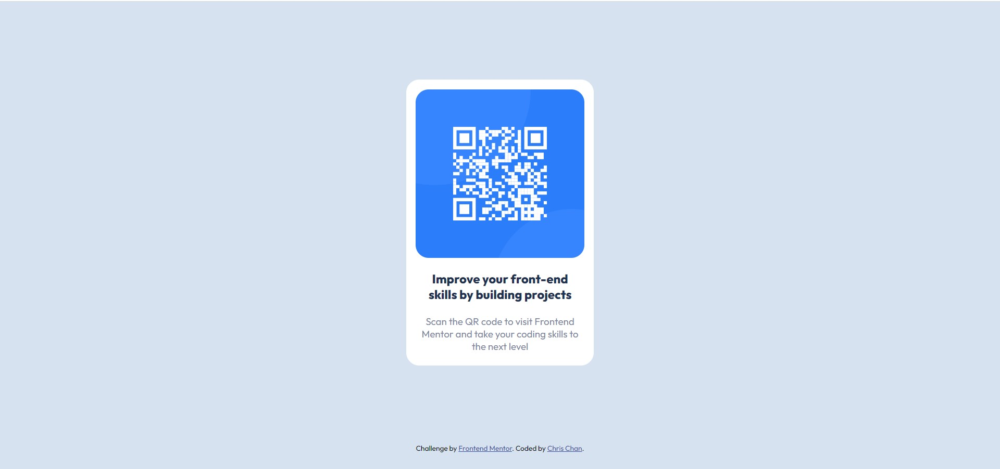

# Frontend Mentor - QR code component solution

This is a solution to the [QR code component challenge on Frontend Mentor](https://www.frontendmentor.io/challenges/qr-code-component-iux_sIO_H). Frontend Mentor challenges help you improve your coding skills by building realistic projects. 

## Table of contents

- [Overview](#overview)
  - [Screenshot](#screenshot)
- [My process](#my-process)
  - [Built with](#built-with)
  - [What I learned](#what-i-learned)
  - [Continued development](#continued-development)
- [Author](#author)

## Overview

### Screenshot

## My process
First and foremost, I took a look at the provided design in order to get a sense of the structure. This not only helps me determine what HTML tags
to use, but also how I should organize divs and classes, in order to apply my CSS styling.

I then created index.html and defined all the tags I needed. Finally, all that was left was to style it. I started broadly, and worked my way
"into" the HTML.

### Built with
- Flexbox

### What I learned

With this mini-challenge, I gained exposure with front-end mentor, as well as practice with CSS and in particular, Flexbox.

### Continued development

I want to get more practice with CSS. I want to improve in all manners, from general design sense and implementation, to specific tricks.
I had just learned Flexbox and this was my first experience applying it. I ran into some issues, so I also look to utilize it more in the future.

## Author
- Frontend Mentor - [@ctlchan](https://www.frontendmentor.io/profile/ctlchan)
